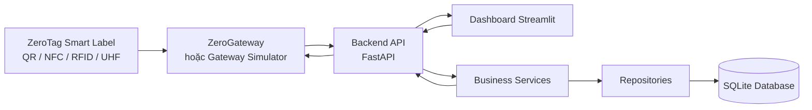
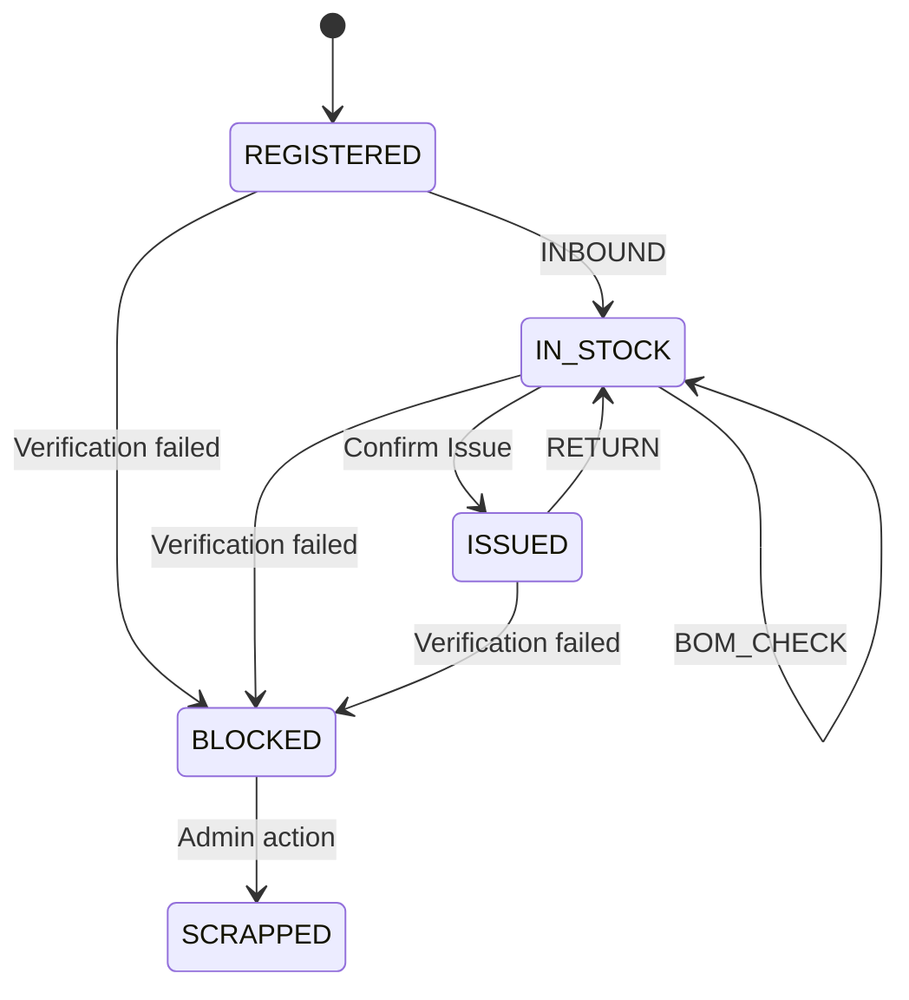
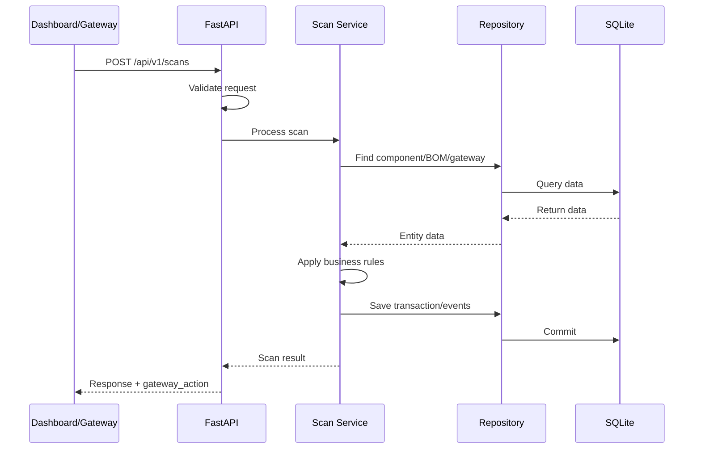

# Kiến trúc hệ thống ZeroTag-Reel MVP

## 1. Mục tiêu kiến trúc

ZeroTag-Reel MVP được thiết kế theo hướng **software-first**, tập trung chứng minh luồng quản lý và kiểm tra reel/tray/carton linh kiện SMT trước khi tích hợp phần cứng thật.

Kiến trúc cần đáp ứng các mục tiêu:

* Build nhanh trong phạm vi MVP 7 ngày.
* Phân tách rõ giao diện, API, nghiệp vụ và dữ liệu.
* Dashboard không phụ thuộc trực tiếp vào database.
* Gateway không chứa logic kiểm tra BOM.
* Có thể thay Gateway Simulator bằng ESP32/NFC/RFID/UHF mà không phải viết lại backend.
* Có thể thay SQLite bằng PostgreSQL trong giai đoạn sau mà không làm thay đổi nghiệp vụ lõi.
* Giữ khả năng mở rộng sang ERP/MES/WMS nhưng không triển khai trong MVP hiện tại.

---

## 2. Kiểu kiến trúc

Dự án sử dụng:

```text
Modular Monolith
+ Layered Architecture
+ Gateway-ready API
```

### Modular Monolith

Toàn bộ backend được triển khai trong một ứng dụng FastAPI duy nhất để giảm độ phức tạp khi build và vận hành MVP.

Các nghiệp vụ vẫn được chia thành module riêng như:

* Inventory
* BOM Matching
* Scan Processing
* Event Logging
* Digital Component Passport
* Traceability
* MSL Tracking
* Verification
* Gateway Management
* Export

Cách tổ chức này giúp MVP build nhanh nhưng vẫn có thể tách thành service riêng nếu dự án mở rộng về sau.

### Layered Architecture

Backend được chia thành các tầng có trách nhiệm rõ ràng:

```text
API Layer
→ Schema / Validation Layer
→ Service / Business Layer
→ Repository Layer
→ Database Layer
```

### Gateway-ready API

Dashboard, Gateway Simulator và phần cứng thật đều sử dụng cùng API contract.

Mọi nguồn scan đều đi qua:

```text
POST /api/v1/scans
```

---

## 3. System Context



Luồng tổng quát:

```text
ZeroTag Smart Label
→ ZeroGateway hoặc Dashboard Scan
→ Backend API
→ Business Services
→ Repository
→ SQLite Database
→ Response cho Dashboard/Gateway
```

---

## 4. Các thành phần chính

### 4.1. ZeroTag Smart Label

Smart Label là lớp nhận diện gắn trên reel/tray/carton.

Trong MVP, nguồn nhận diện có thể là:

* ZeroTag ID nhập thủ công
* QR/DataMatrix
* NFC/HF RFID
* UHF RFID
* Dữ liệu giả lập từ Gateway Simulator

Smart Label không chứa toàn bộ hồ sơ linh kiện. Nó chỉ cung cấp mã nhận diện để backend truy xuất dữ liệu.

Các mã cần phân biệt:

* `zerotag_id`: mã nghiệp vụ của ZeroTag, ví dụ `ZT-R1001`
* `tag_uid`: UID hoặc EPC vật lý của tag NFC/RFID/UHF
* `qr_id`: ZeroTag ID đọc từ QR/DataMatrix
* `rfid_id`: ZeroTag ID được đọc hoặc ánh xạ từ RFID

---

### 4.2. Dashboard

Dashboard được xây dựng bằng Streamlit.

Vai trò:

* Hiển thị tổng quan hệ thống
* Hiển thị danh sách component/reel
* Hiển thị Digital Component Passport
* Gửi yêu cầu scan mô phỏng
* Hiển thị kết quả BOM Matching
* Hiển thị Event Log
* Hiển thị Traceability
* Hiển thị MSL Tracking
* Hiển thị Verification

Dashboard là một API client.

Dashboard không được:

* Đọc SQLite trực tiếp
* Tự xử lý BOM Matching
* Tự quyết định trạng thái tag
* Tự tạo Event Log

---

### 4.3. ZeroGateway

ZeroGateway là thiết bị trung gian giữa Smart Label và Backend API.

Trong MVP, ZeroGateway được mô phỏng bằng Gateway Simulator.

Vai trò của Gateway:

* Đọc ZeroTag ID hoặc tag UID
* Tạo scan payload
* Gửi payload về backend
* Nhận kết quả từ backend
* Điều khiển LED và buzzer theo `gateway_action`

Gateway không được:

* Truy cập database
* Tự kiểm tra BOM
* Tự kiểm tra lot/date-code
* Tự quyết định tag hợp lệ hay không
* Tự thay đổi trạng thái component

---

### 4.4. Backend API

Backend được xây dựng bằng FastAPI.

Backend là điểm xử lý trung tâm của hệ thống.

Vai trò:

* Nhận request từ Dashboard hoặc Gateway
* Validate request
* Xác định scan mode
* Tra cứu component
* Kiểm tra trạng thái tag
* Kiểm tra BOM
* Kiểm tra lot/date-code
* Kiểm tra quantity
* Thực hiện verification
* Tạo ScanTransaction
* Tạo Event Log
* Cập nhật trạng thái component khi nghiệp vụ yêu cầu
* Trả kết quả và gateway action

---

### 4.5. Database

MVP sử dụng SQLite.

Database lưu:

* Component/Reel
* BOM
* BOMItem
* Gateway
* ScanTransaction
* Event
* MSLProfile
* VerificationCheck

SQLite được chọn vì:

* Không cần database server
* Dễ setup
* Phù hợp dữ liệu demo nhỏ
* Dễ kiểm tra và sao lưu
* Phù hợp MVP chạy local

Repository Layer giúp cô lập database khỏi Business Service. Khi chuyển sang PostgreSQL, nghiệp vụ lõi không cần viết lại.

---

## 5. Kiến trúc phân tầng

### 5.1. Client / Presentation Layer

Thành phần:

```text
dashboard/
gateway/simulator/
gateway/firmware_later/
```

Trách nhiệm:

* Nhận thao tác người dùng hoặc dữ liệu tag
* Gửi request đến Backend API
* Hiển thị response
* Không xử lý nghiệp vụ lõi

---

### 5.2. API Layer

Thư mục:

```text
backend/app/api/v1/
```

Trách nhiệm:

* Nhận HTTP request
* Validate dữ liệu đầu vào thông qua schema
* Gọi service tương ứng
* Chuyển kết quả thành HTTP response
* Không viết SQL trực tiếp
* Không chứa logic BOM Matching

---

### 5.3. Schema / Validation Layer

Thư mục:

```text
backend/app/schemas/
```

Trách nhiệm:

* Định nghĩa request schema
* Định nghĩa response schema
* Kiểm tra kiểu dữ liệu
* Kiểm tra field bắt buộc theo API contract
* Chuẩn hóa dữ liệu giữa Dashboard, Gateway và Backend

---

### 5.4. Service / Business Layer

Thư mục:

```text
backend/app/services/
```

Trách nhiệm:

* Điều phối use case
* Xử lý nghiệp vụ
* Kiểm tra BOM
* Kiểm tra trạng thái tag
* Kiểm tra lot/date-code/quantity
* Tạo ScanTransaction
* Tạo Event
* Tính MSL status
* Xử lý Verification
* Trả kết quả nghiệp vụ

Service không truy cập SQLite trực tiếp mà thông qua Repository Layer.

---

### 5.5. Repository Layer

Thư mục:

```text
backend/app/repositories/
```

Trách nhiệm:

* Đọc dữ liệu từ database
* Ghi dữ liệu vào database
* Cập nhật entity
* Thực hiện query theo ZeroTag ID, part number, lot, date-code hoặc transaction

Repository không chứa quy tắc nghiệp vụ.

---

### 5.6. Model / Persistence Layer

Thư mục:

```text
backend/app/models/
backend/app/core/database.py
```

Trách nhiệm:

* Định nghĩa cấu trúc bảng
* Định nghĩa quan hệ giữa các bảng
* Quản lý kết nối SQLite
* Quản lý session/transaction database

---

### 5.7. Core Layer

Thư mục:

```text
backend/app/core/
```

Trách nhiệm:

* Cấu hình ứng dụng
* Kết nối database
* Enum dùng chung
* Error dùng chung
* Biến môi trường

---

## 6. Quy tắc phụ thuộc

Luồng phụ thuộc hợp lệ:

```text
Dashboard / Gateway
→ API
→ Schema
→ Service
→ Repository
→ Database
```

Không cho phép:

```text
Dashboard → Database
Gateway → Database
API Route → SQL trực tiếp
Repository → Dashboard
Database Model → Service
Gateway → BOM Matching Logic
```

Nguyên tắc:

* Tầng trên có thể gọi tầng dưới.
* Tầng dưới không phụ thuộc tầng trên.
* Nghiệp vụ nằm trong Service Layer.
* Truy cập dữ liệu nằm trong Repository Layer.
* Client chỉ giao tiếp thông qua API.

---

## 7. Các module nghiệp vụ

### 7.1. Inventory

Quản lý hồ sơ và trạng thái của reel/tray/carton.

Chức năng:

* Danh sách component
* Tra cứu theo ZeroTag ID
* Theo dõi quantity
* Theo dõi vị trí
* Theo dõi trạng thái

---

### 7.2. Digital Component Passport

Tổng hợp hồ sơ số của một component.

Dữ liệu lấy từ:

* Component
* ScanTransaction
* Event
* VerificationCheck
* MSLProfile

Digital Component Passport là một màn hình tổng hợp, không phải một bảng database độc lập.

---

### 7.3. BOM Matching

Kiểm tra một reel với một dòng BOM cụ thể.

BOM_CHECK sử dụng:

```text
bom_code + bom_ref
```

Ví dụ:

```text
PCB-DEMO-01 + R12
```

Backend kiểm tra:

* Part number
* Lot
* Date-code
* Quantity khả dụng

`bom_item_id` chỉ dùng nội bộ trong database. Dashboard và Gateway sử dụng `bom_code + bom_ref`.

---

### 7.4. Scan Processing

Mọi nguồn scan sử dụng cùng một luồng.

```text
Nhận payload
→ Validate
→ Tìm component
→ Xử lý theo mode
→ Tạo ScanTransaction
→ Tạo Event
→ Trả response
```

Một lần scan tạo:

```text
1 ScanTransaction
+ nhiều Event
```

ScanTransaction lưu kết quả cuối cùng.

Event lưu audit trail chi tiết.

---

### 7.5. Event Logging

Event Log ghi lại từng bước trong nghiệp vụ.

Ví dụ:

```text
REEL_SCANNED
BOM_CHECK_STARTED
BOM_MATCH_OK
BOM_MATCH_FAIL
LOT_MISMATCH
WARNING_ISSUED
WAREHOUSE_IN
RETURN_TO_STOCK
VERIFICATION_PASSED
VERIFICATION_FAILED
TAG_BLOCKED
UNKNOWN_TAG
```

---

### 7.6. Traceability

Cho phép truy xuất theo:

* ZeroTag ID
* Part number
* Lot number
* Date-code

Kết quả gồm:

* Hồ sơ component
* ScanTransaction
* Event timeline
* BOM check history
* Verification history

---

### 7.7. MSL Tracking

Theo dõi dữ liệu MSL ở mức đơn giản.

MVP chỉ tính các trạng thái:

```text
NORMAL
WARNING
NEED_BAKE
```

MSL Tracking không điều khiển thiết bị lưu kho thật.

---

### 7.8. Verification

Kiểm tra tính nhất quán giữa nhận diện vật lý và hồ sơ số.

Các trường hợp:

```text
VALID
QR_RFID_MISMATCH
TAMPER_WARNING
BLOCKED_TAG
UNKNOWN_TAG
```

Nếu có dấu hiệu bất thường, component có thể chuyển sang trạng thái `BLOCKED`.

---

### 7.9. Gateway Management

Quản lý:

* Gateway ID
* Tên gateway
* Vị trí
* Trạng thái online/offline
* Thời điểm hoạt động gần nhất

---

### 7.10. Export

Xuất dữ liệu:

* Component list
* Event Log
* Digital Passport
* Traceability report

Định dạng MVP:

```text
CSV
Excel
```

---

## 8. Scan Mode và trạng thái component

### `INBOUND`

```text
REGISTERED → IN_STOCK
```

Event:

```text
WAREHOUSE_IN
```

### `BOM_CHECK`

Chỉ kiểm tra, không tự động thay đổi trạng thái:

```text
IN_STOCK → IN_STOCK
```

Sau khi kết quả `VALID`, người vận hành có thể xác nhận cấp phát:

```text
IN_STOCK → ISSUED
```

### `RETURN`

```text
ISSUED → IN_STOCK
```

Event:

```text
RETURN_TO_STOCK
```

`RETURNED` không được sử dụng làm trạng thái thường trực trong MVP.

### `VERIFY`

Xác thực thành công không thay đổi trạng thái.

Nếu có QR/RFID mismatch hoặc tamper warning:

```text
REGISTERED / IN_STOCK / ISSUED
→ BLOCKED
```

### State machine MVP



---

## 9. Luồng scan tổng quát



---

## 10. Kết nối phần cứng

Trong giai đoạn chưa có phần cứng:

```text
Gateway Simulator
→ HTTP JSON
→ Backend API
```

Khi có phần cứng thật:

```text
ESP32 + NFC/RFID/UHF Reader
→ HTTP JSON
→ Backend API
```

Backend không thay đổi logic vì Gateway Simulator và Gateway thật dùng cùng API contract.

HTTP được chọn cho MVP vì:

* Dễ debug
* Dễ mô phỏng
* Dễ dùng với ESP32
* Phù hợp một gateway
* Không cần MQTT broker

MQTT có thể được bổ sung khi hệ thống có nhiều gateway hoặc cần xử lý bất đồng bộ.

---

## 11. Cấu trúc thư mục theo kiến trúc

```text
zerotag-reel-mvp/
├── backend/
│   ├── app/
│   │   ├── api/             # API Layer
│   │   ├── schemas/         # Request/Response Validation
│   │   ├── services/        # Business Logic
│   │   ├── repositories/    # Data Access
│   │   ├── models/          # Database Models
│   │   ├── core/            # Config, DB, Enum, Error
│   │   └── seed/            # Seed Data Scripts
│   └── tests/
├── dashboard/               # Streamlit Client
├── gateway/
│   ├── protocol/            # Gateway/API Contract
│   ├── simulator/           # Mock Hardware
│   └── firmware_later/      # ESP32 Firmware sau MVP
├── data/
│   ├── seed_csv/
│   └── exports/
└── docs/
```

---

## 12. Phạm vi không triển khai trong MVP

Các phần sau không thuộc MVP 7 ngày:

* Ambient Backscatter thật
* Đọc hàng trăm tag đồng thời
* Theo dõi vị trí realtime toàn kho
* MQTT production
* ERP/MES/WMS integration
* Cloud multi-tenant
* Advanced authentication
* Supplier Portal
* Buyer Portal
* Firmware OTA
* Multi-gateway orchestration
* Anti-tamper vật lý hoàn chỉnh
* MSL hardware monitoring
* PostgreSQL production deployment

---

## 13. Quyết định kiến trúc đã chốt

### ADR-01 — Backend là trung tâm nghiệp vụ

Dashboard và Gateway chỉ là client.

### ADR-02 — Một endpoint scan thống nhất

Mọi nguồn scan dùng:

```text
POST /api/v1/scans
```

### ADR-03 — BOM_CHECK theo một dòng BOM

Sử dụng:

```text
bom_code + bom_ref
```

### ADR-04 — Một scan tạo một transaction và nhiều event

```text
1 ScanTransaction
+ N Event
```

### ADR-05 — Gateway không xử lý BOM

Gateway chỉ đọc ID, gửi payload và thực hiện `gateway_action`.

### ADR-06 — SQLite cho MVP

SQLite được sử dụng để build nhanh. Repository Layer giữ khả năng chuyển sang PostgreSQL.

### ADR-07 — HTTP cho tích hợp Gateway MVP

Gateway Simulator và ESP32 sau này dùng HTTP JSON với cùng API contract.
