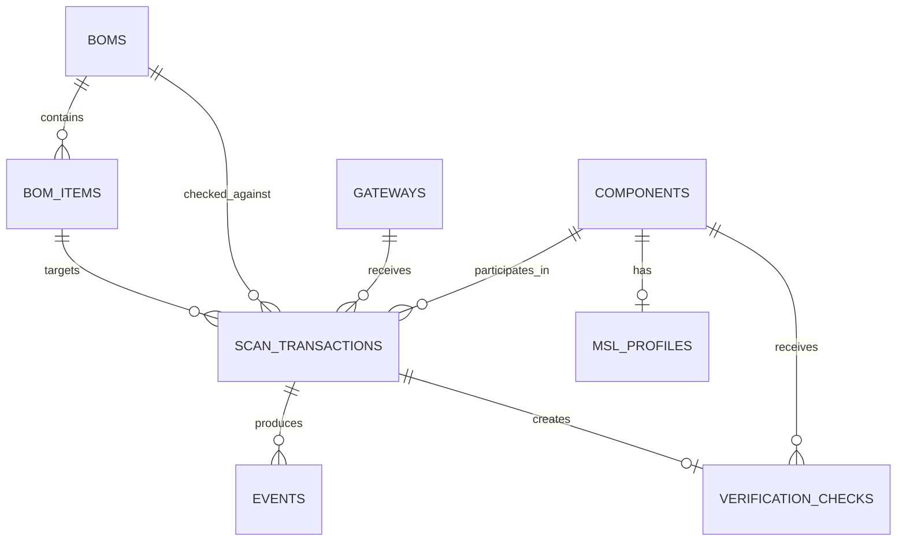

# Database Schema — ZeroTag-Reel MVP

## 1. Mục tiêu thiết kế

Database của ZeroTag-Reel MVP lưu trữ:

* Hồ sơ số của reel/tray/carton
* BOM và từng dòng BOM
* Gateway
* Phiên scan
* Event Log
* Dữ liệu MSL
* Kết quả Verification

MVP sử dụng SQLite để build và demo nhanh.

Kiến trúc Repository Layer phải giữ cho Business Service không phụ thuộc trực tiếp vào SQLite, để có thể chuyển sang PostgreSQL trong giai đoạn sau.

---

## 2. Nguyên tắc thiết kế dữ liệu

### 2.1. Khóa nội bộ và mã nghiệp vụ

Mỗi bảng chính sử dụng:

```text
id: INTEGER PRIMARY KEY AUTOINCREMENT
```

Các mã như:

```text
ZT-R1001
PCB-DEMO-01
ZG-001
TX-000001
```

là mã nghiệp vụ có unique constraint, không thay thế khóa chính nội bộ.

### 2.2. Audit trail

Một lần scan tạo:

```text
1 ScanTransaction
+ N Event
```

`scan_transactions` lưu kết quả tổng thể.

`events` lưu các bước chi tiết.

### 2.3. Không hard delete dữ liệu audit

Trong workflow thông thường:

* Không xóa ScanTransaction
* Không xóa Event
* Không xóa VerificationCheck

Component, BOM và Gateway nên được chuyển trạng thái thay vì xóa vật lý.

### 2.4. Thời gian

Tất cả thời gian được lưu theo ISO 8601.

Ví dụ:

```text
2026-06-06T09:30:00+07:00
```

Trong SQLite, thời gian được lưu dưới dạng `DATETIME` hoặc chuỗi ISO 8601 thông qua SQLAlchemy.

### 2.5. JSON trong SQLite

Các trường JSON được lưu dưới dạng `TEXT`.

Ví dụ:

```json
["LOT_MISMATCH", "DATECODE_MISMATCH"]
```

hoặc:

```json
{
  "required_lot": "L2026A01",
  "actual_lot": "L2025X09"
}
```

Application Layer chịu trách nhiệm serialize và deserialize JSON.

---

# 3. Sơ đồ quan hệ



Quan hệ chính:

```text
BOM 1 ─── N BOMItem

Component 1 ─── N ScanTransaction

Gateway 1 ─── N ScanTransaction

BOM 1 ─── N ScanTransaction

BOMItem 1 ─── N ScanTransaction

ScanTransaction 1 ─── N Event

Component 1 ─── 0..1 MSLProfile

Component 1 ─── N VerificationCheck

ScanTransaction 1 ─── 0..1 VerificationCheck
```

---

# 4. Bảng `components`

## 4.1. Mục đích

Lưu hồ sơ số của từng reel/tray/carton linh kiện.

Mỗi ZeroTag ID đại diện cho một đơn vị vật lý cụ thể.

## 4.2. Cấu trúc

| Trường             | Kiểu     | Bắt buộc | Ràng buộc                   | Mô tả                                |
| ------------------ | -------- | -------: | --------------------------- | ------------------------------------ |
| `id`               | INTEGER  |       Có | PK, AUTOINCREMENT           | Khóa nội bộ                          |
| `zerotag_id`       | TEXT     |       Có | UNIQUE                      | Mã nghiệp vụ, ví dụ `ZT-R1001`       |
| `tag_uid`          | TEXT     |    Không | UNIQUE khi có giá trị       | UID/EPC vật lý của tag               |
| `part_number`      | TEXT     |       Có | INDEX                       | Mã linh kiện                         |
| `component_name`   | TEXT     |       Có |                             | Tên linh kiện                        |
| `manufacturer`     | TEXT     |    Không |                             | Nhà sản xuất                         |
| `supplier`         | TEXT     |    Không |                             | Nhà cung cấp                         |
| `lot_number`       | TEXT     |       Có | INDEX                       | Mã lot                               |
| `date_code`        | TEXT     |       Có | INDEX                       | Date-code dạng cố định, ví dụ `2520` |
| `quantity_initial` | INTEGER  |       Có | `>= 0`                      | Số lượng ban đầu                     |
| `quantity_current` | INTEGER  |       Có | `>= 0`                      | Số lượng hiện tại                    |
| `status`           | TEXT     |       Có | INDEX, DEFAULT `REGISTERED` | Trạng thái component                 |
| `location`         | TEXT     |    Không |                             | Vị trí hiện tại                      |
| `label_type`       | TEXT     |       Có | DEFAULT `STANDARD`          | Loại nhãn                            |
| `tamper_status`    | TEXT     |       Có | DEFAULT `NORMAL`            | Trạng thái anti-tamper               |
| `created_at`       | DATETIME |       Có | DEFAULT CURRENT_TIMESTAMP   | Thời điểm tạo                        |
| `updated_at`       | DATETIME |       Có | DEFAULT CURRENT_TIMESTAMP   | Thời điểm cập nhật                   |

## 4.3. Giá trị trạng thái

`status`:

```text
REGISTERED
IN_STOCK
ISSUED
BLOCKED
SCRAPPED
```

Không sử dụng `RETURNED` làm trạng thái thường trực trong MVP.

`label_type`:

```text
STANDARD
ANTI_TAMPER
```

`tamper_status`:

```text
NORMAL
WARNING
```

## 4.4. Quy tắc

* `zerotag_id` không được trùng.
* `tag_uid` không được trùng nếu đã được khai báo.
* `quantity_current` không được âm.
* `quantity_initial` không được âm.
* Kiểm tra `quantity_current <= quantity_initial` được xử lý tại Service Layer để hỗ trợ điều chỉnh dữ liệu khi cần.
* Component ở trạng thái `SCRAPPED` không được quay lại workflow thông thường.

## 4.5. Index

```text
UNIQUE INDEX components.zerotag_id
UNIQUE INDEX components.tag_uid
INDEX components.part_number
INDEX components.lot_number
INDEX components.date_code
INDEX components.status
```

---

# 5. Bảng `boms`

## 5.1. Mục đích

Lưu thông tin tổng quát của một BOM.

## 5.2. Cấu trúc

| Trường         | Kiểu     | Bắt buộc | Ràng buộc                 | Mô tả                       |
| -------------- | -------- | -------: | ------------------------- | --------------------------- |
| `id`           | INTEGER  |       Có | PK, AUTOINCREMENT         | Khóa nội bộ                 |
| `bom_code`     | TEXT     |       Có | UNIQUE                    | Mã BOM, ví dụ `PCB-DEMO-01` |
| `product_name` | TEXT     |       Có |                           | Tên sản phẩm                |
| `description`  | TEXT     |    Không |                           | Mô tả                       |
| `status`       | TEXT     |       Có | INDEX, DEFAULT `ACTIVE`   | Trạng thái BOM              |
| `created_at`   | DATETIME |       Có | DEFAULT CURRENT_TIMESTAMP | Thời điểm tạo               |
| `updated_at`   | DATETIME |       Có | DEFAULT CURRENT_TIMESTAMP | Thời điểm cập nhật          |

## 5.3. Giá trị trạng thái

```text
ACTIVE
INACTIVE
```

Chỉ BOM ở trạng thái `ACTIVE` được sử dụng trong BOM_CHECK.

## 5.4. Index

```text
UNIQUE INDEX boms.bom_code
INDEX boms.status
```

---

# 6. Bảng `bom_items`

## 6.1. Mục đích

Lưu từng dòng linh kiện yêu cầu trong một BOM.

BOM_CHECK xác định dòng BOM bằng:

```text
bom_code + bom_ref
```

Trong database, dòng BOM được liên kết bằng `bom_id`.

## 6.2. Cấu trúc

| Trường                   | Kiểu     | Bắt buộc | Ràng buộc                 | Mô tả                                           |
| ------------------------ | -------- | -------: | ------------------------- | ----------------------------------------------- |
| `id`                     | INTEGER  |       Có | PK, AUTOINCREMENT         | Khóa nội bộ                                     |
| `bom_id`                 | INTEGER  |       Có | FK → `boms.id`, INDEX     | BOM cha                                         |
| `bom_ref`                | TEXT     |       Có | UNIQUE cùng `bom_id`      | Reference designator, ví dụ `R12`               |
| `required_part_number`   | TEXT     |       Có | INDEX                     | Part number yêu cầu                             |
| `allowed_lot`            | TEXT     |    Không |                           | Lot được phép; NULL nghĩa là không giới hạn lot |
| `allowed_date_code_from` | TEXT     |    Không |                           | Date-code bắt đầu                               |
| `allowed_date_code_to`   | TEXT     |    Không |                           | Date-code kết thúc                              |
| `required_quantity`      | INTEGER  |       Có | `> 0`                     | Số lượng yêu cầu                                |
| `note`                   | TEXT     |    Không |                           | Ghi chú                                         |
| `created_at`             | DATETIME |       Có | DEFAULT CURRENT_TIMESTAMP | Thời điểm tạo                                   |
| `updated_at`             | DATETIME |       Có | DEFAULT CURRENT_TIMESTAMP | Thời điểm cập nhật                              |

## 6.3. Constraint

```text
UNIQUE (bom_id, bom_ref)
```

Điều này đảm bảo một BOM không có hai dòng cùng `bom_ref`.

## 6.4. Quy tắc date-code

Date-code được lưu dưới dạng TEXT có độ dài cố định.

Ví dụ:

```text
2520
2540
```

Service Layer chịu trách nhiệm:

* Kiểm tra định dạng
* So sánh khoảng date-code
* Xử lý trường hợp khoảng không được cấu hình

## 6.5. Index

```text
INDEX bom_items.bom_id
INDEX bom_items.required_part_number
UNIQUE INDEX (bom_items.bom_id, bom_items.bom_ref)
```

---

# 7. Bảng `gateways`

## 7.1. Mục đích

Lưu thông tin ZeroGateway, Gateway Simulator hoặc gateway phần cứng thật.

## 7.2. Cấu trúc

| Trường         | Kiểu     | Bắt buộc | Ràng buộc                 | Mô tả                        |
| -------------- | -------- | -------: | ------------------------- | ---------------------------- |
| `id`           | INTEGER  |       Có | PK, AUTOINCREMENT         | Khóa nội bộ                  |
| `gateway_id`   | TEXT     |       Có | UNIQUE                    | Mã nghiệp vụ, ví dụ `ZG-001` |
| `gateway_name` | TEXT     |       Có |                           | Tên gateway                  |
| `gateway_type` | TEXT     |       Có | DEFAULT `SIMULATOR`       | Loại gateway                 |
| `location`     | TEXT     |    Không |                           | Vị trí mặc định              |
| `status`       | TEXT     |       Có | INDEX, DEFAULT `OFFLINE`  | Trạng thái                   |
| `last_seen_at` | DATETIME |    Không | INDEX                     | Lần hoạt động gần nhất       |
| `created_at`   | DATETIME |       Có | DEFAULT CURRENT_TIMESTAMP | Thời điểm tạo                |
| `updated_at`   | DATETIME |       Có | DEFAULT CURRENT_TIMESTAMP | Thời điểm cập nhật           |

## 7.3. Gateway type

```text
SIMULATOR
ESP32_NFC
ESP32_RFID
ESP32_UHF
```

## 7.4. Gateway status

```text
ONLINE
OFFLINE
DISABLED
```

## 7.5. Index

```text
UNIQUE INDEX gateways.gateway_id
INDEX gateways.status
INDEX gateways.last_seen_at
```

---

# 8. Bảng `scan_transactions`

## 8.1. Mục đích

Lưu kết quả tổng thể của một lần scan.

Một request hợp lệ hoặc không hợp lệ về nghiệp vụ đều có thể tạo ScanTransaction.

Ví dụ:

* VALID
* WRONG_PART
* LOT_MISMATCH
* UNKNOWN_TAG
* QR_RFID_MISMATCH

## 8.2. Cấu trúc

| Trường                    | Kiểu     | Bắt buộc | Ràng buộc                   | Mô tả                               |
| ------------------------- | -------- | -------: | --------------------------- | ----------------------------------- |
| `id`                      | INTEGER  |       Có | PK, AUTOINCREMENT           | Khóa nội bộ                         |
| `transaction_id`          | TEXT     |       Có | UNIQUE                      | Mã transaction, ví dụ `TX-000001`   |
| `request_id`              | TEXT     |       Có | UNIQUE                      | Mã request dùng chống gửi trùng     |
| `component_id`            | INTEGER  |    Không | FK → `components.id`, INDEX | NULL khi unknown tag                |
| `gateway_ref_id`          | INTEGER  |       Có | FK → `gateways.id`, INDEX   | Gateway gửi request                 |
| `bom_id`                  | INTEGER  |    Không | FK → `boms.id`, INDEX       | Chỉ dùng cho BOM_CHECK              |
| `bom_item_id`             | INTEGER  |    Không | FK → `bom_items.id`, INDEX  | Dòng BOM được kiểm tra              |
| `mode`                    | TEXT     |       Có | INDEX                       | Scan mode                           |
| `location`                | TEXT     |       Có |                             | Vị trí scan tại thời điểm thực hiện |
| `input_zerotag_id`        | TEXT     |    Không | INDEX                       | ZeroTag ID nhận từ request          |
| `input_tag_uid`           | TEXT     |    Không | INDEX                       | UID/EPC nhận từ request             |
| `input_qr_id`             | TEXT     |    Không |                             | QR ID nhận từ request               |
| `input_rfid_id`           | TEXT     |    Không |                             | RFID ID nhận từ request             |
| `final_result`            | TEXT     |       Có | INDEX                       | Scan result cuối cùng               |
| `violations_json`         | TEXT     |       Có | DEFAULT `[]`                | Danh sách vi phạm                   |
| `message`                 | TEXT     |    Không |                             | Thông báo tổng thể                  |
| `component_status_before` | TEXT     |    Không |                             | Trạng thái trước xử lý              |
| `component_status_after`  | TEXT     |    Không |                             | Trạng thái sau xử lý                |
| `read_at`                 | DATETIME |       Có | INDEX                       | Thời điểm gateway đọc tag           |
| `started_at`              | DATETIME |       Có | DEFAULT CURRENT_TIMESTAMP   | Thời điểm backend bắt đầu xử lý     |
| `completed_at`            | DATETIME |    Không |                             | Thời điểm xử lý hoàn tất            |

## 8.3. Scan mode

```text
INBOUND
BOM_CHECK
RETURN
VERIFY
```

## 8.4. Scan result

```text
VALID
WRONG_PART
LOT_MISMATCH
DATECODE_MISMATCH
UNKNOWN_TAG
BLOCKED_TAG
QR_RFID_MISMATCH
TAMPER_WARNING
```

Không sử dụng:

```text
LOT_AND_DATECODE_MISMATCH
```

Nếu có nhiều lỗi, `final_result` giữ lỗi chính và `violations_json` lưu đầy đủ các lỗi.

Ví dụ:

```json
{
  "final_result": "LOT_MISMATCH",
  "violations_json": [
    "LOT_MISMATCH",
    "DATECODE_MISMATCH"
  ]
}
```

## 8.5. Lý do lưu raw input

Các trường `input_*` lưu dữ liệu gốc từ request.

Điều này cần thiết vì:

* Unknown tag không có `component_id`
* Cần điều tra dữ liệu gateway đã gửi
* Cần đối chiếu QR và RFID
* Không phụ thuộc vào dữ liệu component có thể thay đổi sau đó

## 8.6. Index

```text
UNIQUE INDEX scan_transactions.transaction_id
UNIQUE INDEX scan_transactions.request_id
INDEX scan_transactions.component_id
INDEX scan_transactions.gateway_ref_id
INDEX scan_transactions.bom_id
INDEX scan_transactions.bom_item_id
INDEX scan_transactions.mode
INDEX scan_transactions.final_result
INDEX scan_transactions.read_at
INDEX scan_transactions.input_zerotag_id
INDEX scan_transactions.input_tag_uid
```

---

# 9. Bảng `events`

## 9.1. Mục đích

Lưu từng bước xảy ra trong một ScanTransaction.

Event Log là audit trail và không được chỉnh sửa/xóa trong workflow thông thường.

## 9.2. Cấu trúc

| Trường                | Kiểu     | Bắt buộc | Ràng buộc                          | Mô tả                          |
| --------------------- | -------- | -------: | ---------------------------------- | ------------------------------ |
| `id`                  | INTEGER  |       Có | PK, AUTOINCREMENT                  | Khóa nội bộ                    |
| `event_id`            | TEXT     |       Có | UNIQUE                             | Mã event                       |
| `scan_transaction_id` | INTEGER  |       Có | FK → `scan_transactions.id`, INDEX | Transaction cha                |
| `sequence_no`         | INTEGER  |       Có | `>= 1`                             | Thứ tự event trong transaction |
| `event_type`          | TEXT     |       Có | INDEX                              | Loại event                     |
| `result`              | TEXT     |       Có | INDEX                              | Kết quả event                  |
| `message`             | TEXT     |    Không |                                    | Nội dung event                 |
| `metadata_json`       | TEXT     |       Có | DEFAULT `{}`                       | Dữ liệu bổ sung                |
| `created_at`          | DATETIME |       Có | INDEX, DEFAULT CURRENT_TIMESTAMP   | Thời điểm tạo                  |

## 9.3. Event result

`result` của Event khác với `final_result` của ScanTransaction.

Event result chỉ sử dụng:

```text
OK
WARNING
FAIL
```

Ví dụ:

```text
REEL_SCANNED       → OK
BOM_CHECK_STARTED  → OK
BOM_MATCH_FAIL     → FAIL
WARNING_ISSUED     → WARNING
```

## 9.4. Event type MVP

```text
REEL_SCANNED
WAREHOUSE_IN
BOM_CHECK_STARTED
BOM_MATCH_OK
BOM_MATCH_FAIL
LOT_MISMATCH
DATECODE_MISMATCH
WARNING_ISSUED
UNKNOWN_TAG
RETURN_TO_STOCK
COMPONENT_ISSUED
VERIFICATION_PASSED
VERIFICATION_FAILED
TAMPER_WARNING
BLOCKED_TAG
TAG_BLOCKED
```

## 9.5. Constraint

```text
UNIQUE (scan_transaction_id, sequence_no)
```

## 9.6. Index

```text
UNIQUE INDEX events.event_id
INDEX events.scan_transaction_id
INDEX events.event_type
INDEX events.result
INDEX events.created_at
UNIQUE INDEX (events.scan_transaction_id, events.sequence_no)
```

---

# 10. Bảng `msl_profiles`

## 10.1. Mục đích

Lưu cấu hình và dữ liệu MSL đơn giản của component nhạy ẩm.

Mỗi component có tối đa một MSLProfile.

## 10.2. Cấu trúc

| Trường                   | Kiểu     | Bắt buộc | Ràng buộc                    | Mô tả                                |
| ------------------------ | -------- | -------: | ---------------------------- | ------------------------------------ |
| `id`                     | INTEGER  |       Có | PK, AUTOINCREMENT            | Khóa nội bộ                          |
| `component_id`           | INTEGER  |       Có | UNIQUE, FK → `components.id` | Component liên quan                  |
| `msl_level`              | TEXT     |       Có |                              | MSL level, ví dụ `3`, `4`, `5`, `2A` |
| `bag_open_time`          | DATETIME |    Không |                              | Thời điểm mở túi                     |
| `floor_life_limit_hours` | REAL     |       Có | `> 0`                        | Giới hạn floor life                  |
| `floor_life_used_hours`  | REAL     |       Có | `>= 0`, DEFAULT `0`          | Số giờ đã sử dụng cho demo           |
| `last_updated_at`        | DATETIME |       Có | DEFAULT CURRENT_TIMESTAMP    | Thời điểm cập nhật                   |

## 10.3. Quy tắc tính MVP

Trong MVP v0.1:

```text
floor_life_used_hours
```

là nguồn dữ liệu chính để tính trạng thái.

`bag_open_time` dùng để hiển thị và truy xuất, chưa tự động tính thời gian theo đồng hồ hệ thống.

Trạng thái MSL được tính tại Service Layer, không lưu cố định trong database:

```text
used < 80% limit
→ NORMAL

80% limit ≤ used < 100% limit
→ WARNING

used ≥ 100% limit
→ NEED_BAKE
```

Việc không lưu `storage_status` tránh tình trạng dữ liệu bị lỗi thời khi số giờ sử dụng thay đổi.

## 10.4. Index

```text
UNIQUE INDEX msl_profiles.component_id
```

---

# 11. Bảng `verification_checks`

## 11.1. Mục đích

Lưu kết quả của từng lần kiểm tra QR/RFID/anti-tamper.

## 11.2. Cấu trúc

| Trường                | Kiểu     | Bắt buộc | Ràng buộc                           | Mô tả                              |
| --------------------- | -------- | -------: | ----------------------------------- | ---------------------------------- |
| `id`                  | INTEGER  |       Có | PK, AUTOINCREMENT                   | Khóa nội bộ                        |
| `verification_id`     | TEXT     |       Có | UNIQUE                              | Mã lần kiểm tra                    |
| `scan_transaction_id` | INTEGER  |       Có | UNIQUE, FK → `scan_transactions.id` | Transaction VERIFY                 |
| `component_id`        | INTEGER  |    Không | FK → `components.id`, INDEX         | NULL khi unknown tag               |
| `qr_id`               | TEXT     |    Không |                                     | ZeroTag ID đọc từ QR               |
| `rfid_id`             | TEXT     |    Không |                                     | ZeroTag ID được đọc/ánh xạ từ RFID |
| `tag_uid_read`        | TEXT     |    Không |                                     | UID/EPC vật lý đã đọc              |
| `verification_result` | TEXT     |       Có | INDEX                               | Kết quả verification               |
| `reason`              | TEXT     |    Không |                                     | Lý do                              |
| `checked_at`          | DATETIME |       Có | INDEX                               | Thời điểm kiểm tra                 |

## 11.3. Verification result

```text
VALID
UNKNOWN_TAG
BLOCKED_TAG
QR_RFID_MISMATCH
TAMPER_WARNING
```

## 11.4. Quy tắc

* Một ScanTransaction ở mode VERIFY tạo tối đa một VerificationCheck.
* `component_id` có thể NULL nếu không ánh xạ được tag.
* QR/RFID mismatch hoặc tamper warning có thể chuyển component sang `BLOCKED`.
* Trạng thái trước và sau được lưu trong ScanTransaction.
* Chi tiết chuyển trạng thái được ghi trong Event.

## 11.5. Index

```text
UNIQUE INDEX verification_checks.verification_id
UNIQUE INDEX verification_checks.scan_transaction_id
INDEX verification_checks.component_id
INDEX verification_checks.verification_result
INDEX verification_checks.checked_at
```

---

# 12. Các đối tượng không có bảng riêng

## 12.1. Digital Component Passport

Digital Component Passport không phải một bảng độc lập.

Nó là dữ liệu tổng hợp từ:

```text
components
scan_transactions
events
msl_profiles
verification_checks
```

## 12.2. Traceability

Traceability không phải một bảng độc lập.

Nó là truy vấn tổng hợp theo:

```text
zerotag_id
part_number
lot_number
date_code
```

## 12.3. Gateway action

`gateway_action` không cần lưu thành bảng riêng.

Nó được Backend Service tạo từ `final_result`.

Nếu cần điều tra, response hoặc action có thể được lưu trong `events.metadata_json`.

## 12.4. Confirm Issue

Thao tác xác nhận cấp phát chưa cần bảng riêng.

MVP xử lý bằng:

```text
Cập nhật components.status → ISSUED
+ ghi Event COMPONENT_ISSUED
```

---

# 13. Mapping entity sang file Day 2

Ngày 2 cần triển khai các model:

```text
backend/app/models/component.py
backend/app/models/bom.py
backend/app/models/bom_item.py
backend/app/models/gateway.py
backend/app/models/scan_transaction.py
backend/app/models/event.py
backend/app/models/msl_profile.py
backend/app/models/verification_check.py
```

Repositories:

```text
backend/app/repositories/component_repo.py
backend/app/repositories/bom_repo.py
backend/app/repositories/gateway_repo.py
backend/app/repositories/scan_repo.py
backend/app/repositories/event_repo.py
backend/app/repositories/msl_repo.py
backend/app/repositories/verification_repo.py
```

Seed scripts:

```text
backend/app/seed/seed_components.py
backend/app/seed/seed_boms.py
backend/app/seed/seed_gateways.py
backend/app/seed/seed_all.py
```

Core database:

```text
backend/app/core/database.py
backend/app/core/enums.py
```

---

# 14. Quyết định database đã chốt

### DB-01 — SQLite cho MVP

SQLite được sử dụng trong MVP v0.1.

### DB-02 — Integer primary key

Mỗi bảng dùng integer primary key nội bộ.

Mã nghiệp vụ được đặt unique constraint.

### DB-03 — Một scan tạo một transaction và nhiều event

```text
1 ScanTransaction
+ N Event
```

### DB-04 — Lưu raw scan input

ScanTransaction lưu các mã nhận được từ client để hỗ trợ unknown tag và audit.

### DB-05 — BOM item xác định bằng BOM và reference

```text
UNIQUE (bom_id, bom_ref)
```

### DB-06 — Không có bảng Passport và Traceability riêng

Hai chức năng này dùng query tổng hợp.

### DB-07 — MSL status được tính động

Không lưu `storage_status` trong database.

### DB-08 — Không hard delete audit data

ScanTransaction, Event và VerificationCheck không được xóa trong workflow thông thường.

### DB-09 — Không dùng RETURNED

Component status MVP chỉ gồm:

```text
REGISTERED
IN_STOCK
ISSUED
BLOCKED
SCRAPPED
```

### DB-10 — Không dùng LOT_AND_DATECODE_MISMATCH

Nhiều vi phạm được lưu trong `violations_json`.
